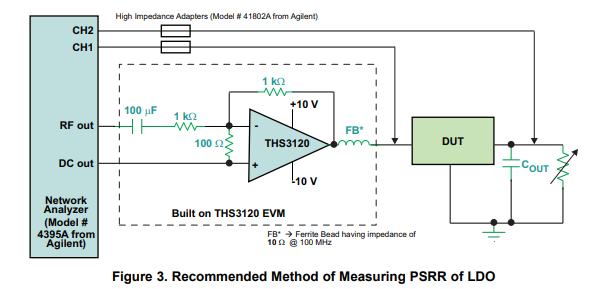

2023.09.19
---

- 配置环境：anaconda3(conda 4.12.0), python 3.9.12
- tools: Everything, Qttabbar
- VScode Extension: GlassIt, Bookmarks, indent-rainbow, Markdown all in one, Material Icon Theme, One Monkai Theme, Python, Pylance, Github Copilot, Tabout  

- 根据《用户指南》学习操作  
- 接口连接P33  
  - 安装 [Key IO Libraries Suite](https://www.keysight.com/us/en/lib/software-detail/computer-software/io-libraries-suite-downloads-2175637.html?jmpid=zzfindiolib)
  - 运行 Keysight Connection Expert 2023
  - USB: 
    - `USB0::<供应商ID>::<Prod ID>::<Serial Number>::0::INSTR`
    - 本机的VISA Adress: `USB0::0x2A8D::0x1002::MY61002637::0::INSTR`
    - 扫描后点开 Interactive IO就能控制了  

- 下载 [Command Expert](https://www.keysight.com/us/en/lib/software-detail/computer-software/command-expert-downloads-2151326.html)  
- 下载 [Benchvue](https://www.keysight.com/us/en/lib/software-detail/computer-software/benchvue-complete-control-collection-download-2814115.html) （要钱的，但好像也没啥用）  

- 安装 `keysight_kte36000`, 即 KtE36000 Driver Python API，注意版本对齐  

2023.10.08
----

- ES3631的测试程序 `ES3631A.py` 调好了，放在 ../DC_power_supply_ES3631A 目录下    

2023.10.10
----

- 写了ES3631A测试程序的帮助文档，和程序放在一个目录下  

- 开始调试Mulitmeter 3458A.  

  - [3458A 中文简明操作指南](https://edadocs.software.keysight.com/kkbopen/3458a-577943035.html)，youtube上也有个视频

  - 发现只有GPIB的接口，需要买一根GPIB/USB的转换线: [LINK](https://www.keysight.com.cn/cn/zh/product/82357B/usb-gpib-interface-high-speed-usb-2-0.html)

- 开始看AWG5202任意波发生器  

  - 要了编程手册    
  - 下载了TekVISA, 和之前那个交互界面差不多，由OpenChoice Manager启动  
  - 下了[IVI Driver](https://www.tek.com/en/support/software/driver/ivi-driver-awg70000a-awg5200-series-arbitrary-waveform)    
  - 好像Driver只有C#, LabView, VB和C++的，没找到Python的  
  - 非官方找到个这个[Python Driver](https://github.com/dahlend/TekAwg/), 但没示例程序，自己先试试   

2023.10.13
------
- GPIB转USB的线到了，开始搞Multimeter 3458A  
- [Python automation](https://www.keysight.com/us/en/assets/7018-06894/white-papers/5992-4268.pdf) Keysight的文章，蛮清楚的，说明了Keysight I/O Libraries是调Keysight的仪器都需要的，SCPI在要远程调控也是必须的  
- 但[link](https://support.keysight.com/KeysightdCX/s/knowledge-article-detail?language=en_US&keyid=Draftedarticleforcasenumber01226604)有提到3458A这个仪器生产于SCPI提出之前，所以在Keysight Connection Expert里连接时，直接`IDN?`是不会响应的，最好需要`END ON`或`END ALWAYS`, 然后`ID?`才会回复`HP3458A`，才可以进行后续的测试  
- 学习使用PyVisa，[这个](https://pyvisa.readthedocs.io/en/latest/api/visalibrarybase.html)是API  

2023.10.17
------
- 部署项目到了github, 这里有一些使用的[注意事项](https://blog.csdn.net/qq_44441669/article/details/103539420), git指令的cheat sheet放桌面上了  
- Multimeter 3458A基本写好了，也附了README。以后需要用啥功能再补，应该很快的
- 开始看AWG5204, 示波器为 MSO64B
  - [SourceXpress](https://www.youtube.com/watch?v=d9Lr_3xziB4), AWG机子上的软件的电脑版

- 看 Ceyear 1465L信号发生器。群里有文档，回去看。

2023.10.24
-----
- 调试 Ceyear 1465L
- 频率和功率模式都设置好了
- 后续还得注意防止命令交迭进行之类的事情，具体见manual里的p225，用到再加
- 开始调试 Tektronix MSO64B 示波器
- 能把图像传到电脑上了
- 还需要把波形采样成`.csv`文件

2023.10.27
------
- 测试下示波器采样和绘图程序，一下就好了。B站真好用（bushi
- 基本上好了，有些细节准备后续测试再细化
- 和老师讨论好了后续测试流程，给了点论文参考，见1_thesis

2023.10.31
----
- 开始测试LDO芯片 `LT3045`
- 接口连接方式见 `test/sch`, 只能说有输出
- 准备先测试PSRR
- ~~Multimeter莫名其妙连不上了~~ 搞了两个多小时最后重启电脑就好了（呃呃

2023.11.3
------
- 代码和文件夹结构重构了下，测试代码统一放在test文件夹下，设备模块都放在modules下
- 重构进度：
  - 电源：只能开关机，设置输出电压和通道；
  - 万用表: 自检，设置检测电压/电流，设置量程，读取仪表盘读数
  - 信号发生器：设置频率和功率
- 测完LDO再写各个module的README吧

2023.11.7
-----
- 写测试代码
- 重构进度
  - 示波器：截屏传输到本地
- [Tektronix Programmatic Control Samples](https://github.com/tektronix/Programmatic-Control-Examples)
- 可以参考官方 [MSO 6 Series](https://github.com/tektronix/Programmatic-Control-Examples/tree/master/Examples/Oscilloscopes/TekSeriesScopes_HighSpeedDigitizers)

2023.11.10
------
- 新的GPIB线到了
- ~~示波器连接有点问题~~ 注意连接多个设备的时候地址区分好 `GPIB0`, `GPIB1`, `USB0`, `USB1`
- 先补充下信号发生器功能，搞LFO
- 对python nested class有点问题

2023.11.14
------
- 更新了信号发生器低频输出功能，信号发生器类结构略有修改
- 更新了示波器的保存图像和波形文件，添加了采样并绘图功能
  - 尝试保存csv文件但总有问题，采用了wfm转csv方案，还不完善
- 汇报了一下进度，周五准备测试 LDO PSRR

2023.11.17
-------
- 讨论了LDO PSRR测试方法
- [测试方法](https://zhuanlan.zhihu.com/p/112357432)大致有三种，
  - 示波器测量PSRR
  - AP+放大器
  - 注入器+电源网络分析仪
- 目前只能用示波器方案，LDO芯片太好了，精度不太够。试了频谱分析仪测量，貌似也不行
- 注意测量PSRR的时候需要考虑外接电容、负载等，对结果影响较大
- 有点难蚌。因为测得都是低频嘛，但信号发生器低频模式没法远控设置offset，只能手操，编程手册说这个功能还没实现，明明应该是很简单的功能，害... 连低精度的示波器方案也不行了。  
   
- 梅老师让我先把理论搞搞熟，准备先仿真一个测试方案。仿真好了画板子，相当于手搓一个先
  - 测试方案的样式大概如下  

  - 

- 根据群里发的链接PSpice仿真先

2023.11.21
--------
- 做报告, 进行阶段展示
- 听组会
  - 上电时间一般是us级别
  - 做产品和写论文不一样，产品更注重木桶原理，论文选最极致的
  - [Guard ring](https://zhuanlan.zhihu.com/p/44822758), 给两圈，pick up，可能顺便给电源和地打一圈
  - 解天线效应可以先绕道M7再绕回来
  - ROIC ADC

- 尹老师好像挺感兴趣我的beamer的，这里放个我魔改的[link](https://www.overleaf.com/latex/templates/fdu-beamer-theme/vjhpmpndbqtc)(本来是复旦学长魔改清华的)

- 以后可能还得讲点latex, matlab之类的东西

2023.11.24
-----
- 下午和梅老师聊关于郭吉元的事情
- 借了本书：《CMOS低压差线性稳压器》王忆、何乐年等著
- Cadence了解下大概的学习曲线，可能的话再看下嘉立创EDA的PCB怎么画
- 准备安装一个Cadence SPB 17.2

2023.11.28
-----
- 芯片研发测试实验室的门禁密码是654321
- 还是准备在Linux上安Cadence IC617，学学梅老师给的书先
- Cadence 安装在 `D:/Cadence`下
  - win_version: [PSpice 17.2 安装教程](https://blog.csdn.net/weixin_46161549/article/details/117784869), [Cadence OrCAD Allegro 资源分享](https://www.mr-wu.cn/cadence-orcad-allegro-resource-downloads/)(含阿狸狗破解), [PSpice 教程学习笔记](https://blog.csdn.net/qq_42240380/article/details/122378841)
  - linux_version: [Cadence IC设计环境搭建（IC617+MMSIM151+Calibre2015）](https://cloud.tencent.com/developer/article/2033462)  
   
- Linux_version安装笔记:
  - VMWare 14在win11下不好使，换了17; 共享文件夹放在 `D:\Cadence\linux_version\share`
  - ~~CentOS 7 配置~~ 搞了一下午太烦了不行  
  - 转向[Cadence Virtuoso IC617的启动和新建工程](https://blog.csdn.net/qq_39792063/article/details/122056524)
  - 下了[EETOP上配置好的 IC617](https://bbs.eetop.cn/thread-895652-1-1.html)，网盘下载有点慢，麻了

2023.12.1
-----
- ~~之前梅老师帮忙在电脑安装了一个Cadence IC618~~ 有问题，老师说后面再说
- 整理实验室 
  - 按邓老师要求理了下，理好拍了个视频发过去了
- 重新安装了Cadence OrCAD 和 Allegro

2023.12.5
------
- 学点git commit规范
  - ` git commit -m"`curl -s http://whatthecommit.com/index.txt`"` 随机生成commit，这也太搞了哈哈
  - 参考 [阮一峰 博客](http://www.ruanyifeng.com/blog/2016/01/commit_message_change_log.html)，[Angular规范](https://docs.google.com/document/d/1QrDFcIiPjSLDn3EL15IJygNPiHORgU1_OOAqWjiDU5Y/edit?pli=1#heading=h.greljkmo14y0)  
  - 安装 commitizen
    - 下载nodejs
      - nodejs安装路径: D:\Program Files\nodejs
      - 注意要开管理员模式
      - [安装参考](https://blog.csdn.net/weixin_43128203/article/details/118194415)
- 学LDO基础知识，尽量做出些**进展**，感觉有点停滞了
- 梅老师把虚拟机和资料拷给我了
  - 重装了下VMWare 17, 放在 `D:\Program Files\VMWare`
  - IC618虚拟机的共享文件夹不变，本机D盘都能共享
  - 资料再拷了一份放在 `.\reference\LDO`下
    - 有cadence vco psrr的测量范例
    - 有学长做的简单的LDO的设计仿真，帮助上手

2023.12.8
-----
- 下载了[模拟IC设计Cadence网课](https://caiyun.139.com/w/i/1A5CvX4US421D)
- 安装了Potplayer
- 学习Cadence操作

2023.12.19
----
- 学习梅老师给到的B站视频，讲LDO设计
- 学习Cadence
- 调试Tektronix AWG5204

2023.12.22
-----
- 调试Tektronix AWG5204

2023.12.26
-----
- 顾俊杰学长来指导了下，需要调试信号发生器SMA100B, 2438PA微波功率计, 3672E矢量网络分析仪, 4051L频谱分析仪
- 调试好了2438PA微波功率计
- SMA100B背板上的GPIB口被封住了，需要特比的梅花六角螺丝刀，邓老师买了
- 准备调试3672E矢量网络分析仪

2024.1.2
-----
- 新年快乐~
- 调试SMA100B
  - 拆SMA100B后面板的梅花六角螺丝刀到了，但还是太大了
  - 换了LAN网线链接，调调看

2024.1.4
----
- 调试SMA100B
  - 基础功能,大部分输出功能都搞明白了
  - 其他一些怪怪的包括计算和作图都没搞

2024.1.5
-----
- SMA100B暂时调试完毕
  - 输出功能除了FM、AM等的细节参数未调节，其他都调好了
  - 监控、存储、传输等功能由于选配件的问题，无法调试

2024.1.9
------
- 准备新增 Error handling & 越过模块化直接写SCPI指令的函数
  - 电源 `DCPowerSupply_ES3631A` 因为使用的是外部现有模块，暂时不加直接写SCPI指令的函数
  - Error handling 就 直接读 `SYST:ERR?` 吧，然后可能在测试文件里加个`try...except...finnally...`之类的结构

- 增补模块功能
  - 电源 `DCPowerSupply_ES3631A` 
    - 支持电压电流读取
  - 万用表 `Multimeter_3458A`
    - 优化，合并两步设置操作为一步
    - 支持直接的 write/query SCPI指令
  - 信号发生器 `SignalGenerator_1465L`
    - 优化模块代码结构，增加输出功率电平子类
    - 支持直接的 write/query SCPI指令
  - 功率计 `MicrowavePowerMeter_2438PA`
    - 支持直接的 write/query SCPI指令

- 开始调试 网络分析仪 `VectorNetworkAnalyzer_3672E`
  - 建议先看 Guide.pdf, 使用门槛比一般仪器要高不少，有好多使用要求
  - [矢量网络分析仪 使用笔记](https://zhuanlan.zhihu.com/p/566389003)

2024.1.12
----
- 继续调试 网络分析仪 `VectorNetworkAnalyzer_3672E`
- 测试Docker使用和环境配置

2024.1.16
----
- 调试 网络分析仪 `VectorNetworkAnalyzer_3672E`
  - 基础的打开窗口、设置轨迹、设置测量、设置扫描参数都好了
  - snp文件的保存与传输

- todo: 后续要调试 [Toomoss USB2XXX总线适配器](http://www.toomoss.com/product/8-cn.html)

- 晚上顾俊杰给了我PACW测试文档,根据那个写了个简单的测试程序,见 `TEST/PACW`文件夹

2024.1.19
-----
- 写了对MOS建模测试数据
- 邓磊让我编了2023年的温湿度数据
- PACW.py 根据书签增加保存文件的时间；增加module中的test demo, 见直流电源ES3631A

2024.1.23
----
- 测试 PACW测试流程 
  - sheet 格式准备再改下
<!-- - MPM module set frequency: Hz -> GHz -->
  - 没啥问题了

2024.1.30
----
- 准备modularize网分

2024.1.31
----
- 中午和尹睿老师组12个人出去聚餐了，张江长泰广场的新疆餐厅
- 改网分的SNP文件的数据处理脚本，基本操作已完成，但尚未模块化

2024.2.2
----
- 进行了张简凡学姐的LDO Vin-Vout的测试
  - 由于ET5300A可编程直流电子负载没找到编程手册，不晓得咋写，就只进行了没负载情况下的自动化测试
- 进行网分代码的模块化
  - 默认测试的模块编写已完成，具体参数的修改功能等有需求再加

2024.2.21
----
- github新建了LDO的私有仓库
- 在根目录下新建了`scripts`文件夹，用于存放一些非仪器的脚本，如：
  - `scripts/COMassist` 串口调试助手
- 在TEST目录下新建测试项`4_PhaseShifter_SP`，用于进行移相器自动化测试
  - 尚未干完，周五继续

2024.2.29
----
- 学习Chris模拟IC设计课 
- 整理LDO资料

2024.3.1
---
- 继续`PhaseShifter_SP`的自动化测试

2024.3.3, 2023.3.7 
---
- 准备毕业论文开题报告

2024.3.11
---
- 和邓老师, 郭吉元和李斌 帮尹老师 搬办公室

2024.3.14
---
- 基本完成`PhaseShifter_SP`的自动化测试
- 继续教邓老师一些自动化知识和操作
- 学习版图绘制, 看Chris 模拟IC设计课

2024.3.22
----
- 整理仪器说明书

2024.3.25
---
- 整理仪器说明书
