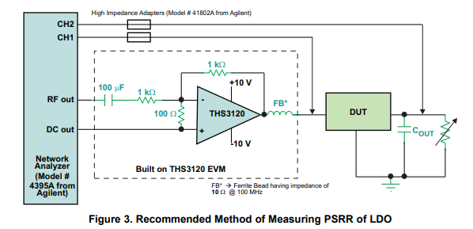

2023.09.19
---

- 配置环境：anaconda3(conda 4.12.0), python 3.9.12
- tools: Everything, Qttabbar
- VScode Extension: GlassIt, Bookmarks, indent-rainbow, Markdown all in one, Material Icon Theme, One Monkai Theme, Python, Pylance, Github Copilot, Tabout  

- 根据《用户指南》学习操作  
- 接口连接P33  
  - 安装 [Key IO Libraries Suite](https://www.keysight.com/us/en/lib/software-detail/computer-software/io-libraries-suite-downloads-2175637.html?jmpid=zzfindiolib)
  - 运行 Keysight Connection Expert 2023
  - USB: 
    - `USB0::<供应商ID>::<Prod ID>::<Serial Number>::0::INSTR`
    - 本机的VISA Adress: `USB0::0x2A8D::0x1002::MY61002637::0::INSTR`
    - 扫描后点开 Interactive IO就能控制了  

- 下载 [Command Expert](https://www.keysight.com/us/en/lib/software-detail/computer-software/command-expert-downloads-2151326.html)  
- 下载 [Benchvue](https://www.keysight.com/us/en/lib/software-detail/computer-software/benchvue-complete-control-collection-download-2814115.html) （要钱的，但好像也没啥用）  

- 安装 `keysight_kte36000`, 即 KtE36000 Driver Python API，注意版本对齐  

2023.10.08
----

- ES3631的测试程序 `ES3631A.py` 调好了，放在 ../DC_power_supply_ES3631A 目录下    

2023.10.10
----

- 写了ES3631A测试程序的帮助文档，和程序放在一个目录下  

- 开始调试Mulitmeter 3458A.  

  - [3458A 中文简明操作指南](https://edadocs.software.keysight.com/kkbopen/3458a-577943035.html)，youtube上也有个视频

  - 发现只有GPIB的接口，需要买一根GPIB/USB的转换线: [LINK](https://www.keysight.com.cn/cn/zh/product/82357B/usb-gpib-interface-high-speed-usb-2-0.html)

- 开始看AWG5202任意波发生器  

  - 要了编程手册    
  - 下载了TekVISA, 和之前那个交互界面差不多，由OpenChoice Manager启动  
  - 下了[IVI Driver](https://www.tek.com/en/support/software/driver/ivi-driver-awg70000a-awg5200-series-arbitrary-waveform)    
  - 好像Driver只有C#, LabView, VB和C++的，没找到Python的  
  - 非官方找到个这个[Python Driver](https://github.com/dahlend/TekAwg/), 但没示例程序，自己先试试   

2023.10.13
------
- GPIB转USB的线到了，开始搞Multimeter 3458A  
- [Python automation](https://www.keysight.com/us/en/assets/7018-06894/white-papers/5992-4268.pdf) Keysight的文章，蛮清楚的，说明了Keysight I/O Libraries是调Keysight的仪器都需要的，SCPI在要远程调控也是必须的  
- 但[link](https://support.keysight.com/KeysightdCX/s/knowledge-article-detail?language=en_US&keyid=Draftedarticleforcasenumber01226604)有提到3458A这个仪器生产于SCPI提出之前，所以在Keysight Connection Expert里连接时，直接`IDN?`是不会响应的，最好需要`END ON`或`END ALWAYS`, 然后`ID?`才会回复`HP3458A`，才可以进行后续的测试  
- 学习使用PyVisa，[这个](https://pyvisa.readthedocs.io/en/latest/api/visalibrarybase.html)是API  

2023.10.17
------
- 部署项目到了github, 这里有一些使用的[注意事项](https://blog.csdn.net/qq_44441669/article/details/103539420), git指令的cheat sheet放桌面上了  
- Multimeter 3458A基本写好了，也附了README。以后需要用啥功能再补，应该很快的
- 开始看AWG5204, 示波器为 MSO64B
  - [SourceXpress](https://www.youtube.com/watch?v=d9Lr_3xziB4), AWG机子上的软件的电脑版

- 看 Ceyear 1465L信号发生器。群里有文档，回去看。

2023.10.24
-----
- 调试 Ceyear 1465L
- 频率和功率模式都设置好了
- 后续还得注意防止命令交迭进行之类的事情，具体见manual里的p225，用到再加
- 开始调试 Tektronix MSO64B 示波器
- 能把图像传到电脑上了
- 还需要把波形采样成`.csv`文件

2023.10.27
------
- 测试下示波器采样和绘图程序，一下就好了。B站真好用（bushi
- 基本上好了，有些细节准备后续测试再细化
- 和老师讨论好了后续测试流程，给了点论文参考，见1_thesis

2023.10.31
----
- 开始测试LDO芯片 `LT3045`
- 接口连接方式见 `test/sch`, 只能说有输出
- 准备先测试PSRR，
- ~~Multimeter莫名其妙连不上了~~ 搞了两个多小时最后重启电脑就好了（呃呃

2023.11.3
------
- 代码和文件夹结构重构了下，测试代码统一放在test文件夹下，设备模块都放在modules下
- 重构进度：
  - 电源：只能开关机，设置输出电压和通道；
  - 万用表: 自检，设置检测电压/电流，设置量程，读取仪表盘读数
  - 信号发生器：设置频率和功率
- 测完LDO再写各个module的README吧

2023.11.7
-----
- 写测试代码
- 重构进度
  - 示波器：截屏传输到本地
- [Tektronix Programmatic Control Samples](https://github.com/tektronix/Programmatic-Control-Examples)
- 可以参考官方 [MSO 6 Series](https://github.com/tektronix/Programmatic-Control-Examples/tree/master/Examples/Oscilloscopes/TekSeriesScopes_HighSpeedDigitizers)

2023.11.10
------
- 新的GPIB线到了
- ~~示波器连接有点问题~~ 注意连接多个设备的时候地址区分好 `GPIB0`, `GPIB1`, `USB0`, `USB1`
- 先补充下信号发生器功能，搞LFO
- 对python nested class有点问题

2023.11.14
------
- 更新了信号发生器低频输出功能，信号发生器类结构略有修改
- 更新了示波器的保存图像和波形文件，添加了采样并绘图功能
  - 尝试保存csv文件但总有问题，采用了wfm转csv方案，还不完善
- 汇报了一下进度，周五准备测试 LDO PSRR

2023.11.17
-------
- 讨论了LDO PSRR测试方法
- [测试方法](https://zhuanlan.zhihu.com/p/112357432)大致有三种，
  - 示波器测量PSRR
  - AP+放大器
  - 注入器+电源网络分析仪
- 目前只能用示波器方案，LDO芯片太好了，精度不太够。试了频谱分析仪测量，貌似也不行
- 注意测量PSRR的时候需要考虑外接电容、负载等，对结果影响较大
- 有点难蚌。因为测得都是低频嘛，但信号发生器低频模式没法远控设置offset，只能手操，编程手册说这个功能还没实现，明明应该是很简单的功能，害... 连低精度的示波器方案也不行了。  
   
- 梅老师让我先把理论搞搞熟，准备先仿真一个测试方案。仿真好了画板子，相当于手搓一个先
  - 测试方案的样式大概如下  

  - 

- 根据群里发的链接PSpice仿真先

2023.11.21
--------
- 做报告, 进行阶段展示
- 听组会
  - 上电时间一般是us级别
  - 做产品和写论文不一样，产品更注重木桶原理，论文选最极致的
  - [Guard ring](https://zhuanlan.zhihu.com/p/44822758), 给两圈，pick up，可能顺便给电源和地打一圈
  - 解天线效应可以先绕道M7再绕回来
  - ROIC ADC

- 尹老师好像挺感兴趣我的beamer的，这里放个我魔改的[link](https://www.overleaf.com/latex/templates/fdu-beamer-theme/vjhpmpndbqtc)(本来是复旦学长魔改清华的)

- 以后可能还得讲点latex, matlab之类的东西

2023.11.24
-----
- 下午和梅老师聊关于郭吉元的事情
- 借了本书：《CMOS低压差线性稳压器》王忆、何乐年等著
- Cadence了解下大概的学习曲线，可能的话再看下嘉立创EDA的PCB怎么画
- 准备安装一个Cadence SPB 17.2

2023.11.28
-----
- 芯片研发测试实验室的门禁密码是654321
- 还是准备在Linux上安Cadence IC617，学学梅老师给的书先
- Cadence 安装在 `D:/Cadence`下
  - win_version: [PSpice 17.2 安装教程](https://blog.csdn.net/weixin_46161549/article/details/117784869), [Cadence OrCAD Allegro 资源分享](https://www.mr-wu.cn/cadence-orcad-allegro-resource-downloads/)(含阿狸狗破解), [PSpice 教程学习笔记](https://blog.csdn.net/qq_42240380/article/details/122378841)
  - linux_version: [Cadence IC设计环境搭建（IC617+MMSIM151+Calibre2015）](https://cloud.tencent.com/developer/article/2033462)  
   
- Linux_version安装笔记:
  - VMWare 14在win11下不好使，换了17; 共享文件夹放在 `D:\Cadence\linux_version\share`
  - ~~CentOS 7 配置~~ 搞了一下午太烦了不行  
  - 转向[Cadence Virtuoso IC617的启动和新建工程](https://blog.csdn.net/qq_39792063/article/details/122056524)
  - 下了[EETOP上配置好的 IC617](https://bbs.eetop.cn/thread-895652-1-1.html)，网盘下载有点慢，麻了
